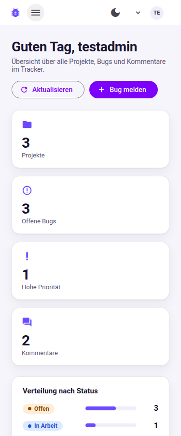

# MiniBugTracker – Frontend

Angular-Frontend zur Spring-Boot-Anwendung
[brixnc/minibugtracker](https://github.com/brixnc/minibugtracker).
Entstanden als Projektarbeit im **ÜK Modul 294 – Frontend einer interaktiven
Webapplikation realisieren**.

Die Anwendung verwaltet **Projekte**, **Bugs** und **Kommentare** über die
REST-Schnittstelle des Backends. Die Anmeldung läuft über **Keycloak
(OAuth 2 / OpenID Connect)**, die Realm-Rollen `USER` und `ADMIN` steuern,
welche Aktionen sichtbar und erlaubt sind.

Aufbau und Benennung folgen dem **Demoprojekt des ÜK**
(<https://docs.superspace.ch/ilv-modul-294>). Kapitel 10 stellt beides
gegenüber.

---

## 1. Technischer Stack

| Baustein          | Version / Ausprägung                                        |
|-------------------|-------------------------------------------------------------|
| Angular           | 18 (Standalone Components, Signals, neue Control-Flow-Syntax) |
| Angular Material  | 18 mit eigenem Material-3-Theme (hell und dunkel)           |
| Authentifizierung | `angular-oauth2-oidc` 18 + `@auth0/angular-jwt` 5, Authorization Code Flow mit PKCE |
| Formulare         | Reactive Forms mit Validatoren analog zur Bean Validation des Backends |
| Tests             | **Vitest** mit `@analogjs/vite-plugin-angular` und jsdom, 54 Tests |
| Codestyle         | ESLint mit `angular-eslint` (Konfiguration des Angular-CLI-Demoprojekts) |
| Schriften         | Roboto und Material Icons als npm-Pakete im Projekt, kein CDN nötig |

---

## 2. Schnellstart

> Die Projektkonfiguration ist für einen lokalen Betrieb ohne Docker gedacht.
> PostgreSQL und Keycloak laufen direkt auf dem Rechner; die Dokumentation in
> `docs/KEYCLOAK-SETUP.md` beschreibt die lokale Einrichtung.

### 2.1 Voraussetzungen

| Dienst                | Adresse                 | Bemerkung                                     |
|-----------------------|-------------------------|-----------------------------------------------|
| Backend (Spring Boot) | `http://localhost:9190` | Repository `minibugtracker`, siehe `docs/BACKEND-AENDERUNGEN.md` |
| Keycloak              | `http://localhost:8080` | Realm `minibugtracker`, siehe `docs/KEYCLOAK-SETUP.md` |
| PostgreSQL            | `localhost:5432`        | Datenbank `bugtracker_db` (vom Backend verwendet) |
| Node.js               | ab 18.19                | für Angular 18                                 |

### 2.2 Starten

```bash
npm install
npm start
```

Die Anwendung läuft danach auf <http://localhost:4300>.

`npm start` verwendet die Datei `proxy.conf.json`: Alle Aufrufe auf `/api`
werden vom Angular-Dev-Server an `http://localhost:9190` weitergeleitet.
Dadurch läuft die Entwicklung auch dann, wenn im Backend keine
CORS-Freigabe gesetzt ist. Der Produktionsbuild spricht das Backend direkt
unter `http://localhost:9190/api` an – dafür ist die CORS-Freigabe
nötig, die in `docs/BACKEND-AENDERUNGEN.md` beschrieben ist.

### 2.3 Weitere Befehle

| Befehl              | Wirkung                                                     |
|---------------------|-------------------------------------------------------------|
| `npm start`         | Entwicklungsserver mit Backend-Proxy auf Port 4300          |
| `npm run build`     | Produktionsbuild nach `dist/minibugtracker-frontend`        |
| `npm test`          | Unit-Tests einmalig mit Vitest                               |
| `npm run test:watch`| Unit-Tests im Watch-Modus                                    |
| `npm run test:ci`   | dasselbe wie `npm test`, ausdrücklich ohne Watch-Modus       |
| `npm run lint`      | ESLint-Prüfung über TypeScript- und HTML-Dateien             |
| `npm run lint:fix`  | ESLint mit automatischer Korrektur                           |

Die Tests brauchen **keinen Browser**: Vitest führt sie in `jsdom` aus.

---

## 3. Projektstruktur

Die Struktur entspricht dem Demoprojekt des ÜK – die Wegleitung zur
Projektarbeit verlangt das ausdrücklich („Die Projektstruktur und die
Codestruktur sollte dem Demoprojekt entsprechen").

```text
src/
├── app/
│   ├── components/                Wiederverwendbare Bausteine
│   │   ├── app-login/             Anmeldung, Benutzermenue, Abmeldung
│   │   ├── toolbar/               Kopfzeile mit Navigation
│   │   ├── comment-list/          Kommentarverlauf eines Bugs
│   │   ├── comment-form/          Neuen Kommentar erfassen
│   │   ├── confirm-dialog/        Rueckfrage vor dem Loeschen
│   │   ├── empty-state/           Platzhalter fuer leere Listen
│   │   ├── status-chip/           Farbige Statuskennzeichnung
│   │   └── priority-chip/         Farbige Prioritaetskennzeichnung
│   ├── data/                      Modelle: Mapping JSON auf Klassen
│   │   ├── bug.ts                 Bug + BugStatus + BugPriority
│   │   ├── project.ts             Project
│   │   ├── comment.ts             Comment
│   │   └── user.ts                CurrentUser
│   ├── directives/
│   │   └── app-is-in-role.dir.ts  *appIsInRoles - rollenabhaengige Anzeige
│   ├── guard/
│   │   ├── app.guard.ts           appCanActivate - Anmeldung und Rollen
│   │   └── app.home.guard.ts      appHomeRedirect - Startseite -> Dashboard
│   ├── interceptors/
│   │   └── error.interceptor.ts   HTTP-Fehler in verstaendliche Meldungen
│   ├── pages/                     Ueber das Routing angesteuerte Seiten
│   │   ├── home/                  Oeffentliche Startseite
│   │   ├── dashboard/             Kennzahlen und zuletzt gemeldete Bugs
│   │   ├── bug-list/              Material-Tabelle mit Filtern
│   │   ├── bug-detail/            Detailansicht mit Kommentaren
│   │   ├── bug-form/              Bug erfassen und bearbeiten
│   │   ├── project-list/          Projektuebersicht
│   │   ├── project-form/          Projekt anlegen und bearbeiten
│   │   ├── profile/               Identitaet und Rollen aus dem Token
│   │   ├── no-access/             Auffangseite bei fehlender Rolle
│   │   └── not-found/             Auffangseite fuer unbekannte Adressen
│   ├── service/                   Zugriff auf das Backend und Querschnitt
│   │   ├── app.auth.service.ts    OAuth 2, Benutzer und Rollen als Signals
│   │   ├── bug.service.ts         CRUD /api/bugs
│   │   ├── project.service.ts     CRUD /api/projects
│   │   ├── comment.service.ts     CRUD /api/comments
│   │   ├── user.service.ts        /api/users
│   │   ├── notification.service.ts  Meldungen (MatSnackBar)
│   │   ├── theme.service.ts       helles / dunkles Design
│   │   └── oauth.stub.ts          Testdouble - nur fuer Unit-Tests
│   ├── app.auth.ts                AuthConfig fuer Keycloak
│   ├── app.roles.ts               Aufzaehlung der Realm-Rollen
│   ├── app.config.ts              Provider, OAuth-Start, HTTP-Client
│   ├── app.routes.ts              Routing inklusive Rollenpruefung
│   ├── app.component.*            Rahmen der Anwendung
│   └── paginator-intl.ts          Deutsche Beschriftung des Paginators
├── environments/                  environment.ts / environment.development.ts
├── test-setup.ts                  TestBed-Umgebung fuer Vitest
└── styles.scss                    Material-3-Theme und semantische Farb-Tokens
```

Die Aufteilung folgt der Vorgabe aus der Wegleitung: „Es hat sich bewährt,
Komponenten in Basiskomponenten und Pages (ganze Seiten, welche über
Angular Routing angesteuert werden) zu unterteilen."

* **components** – Bausteine, die in Seiten eingebettet werden.
* **pages** – ganze Seiten, jede hat einen Eintrag in `app.routes.ts`.
* **data** – die Modelle, auf die die JSON-Antworten abgebildet werden.
* **service** – Zugriff auf das Backend, Authentifizierung, Querschnitt.
* **guard** / **directives** – Absicherung von Routen und Oberfläche.

Alle Seiten werden über `loadComponent` **lazy** geladen, damit der
Startbundle klein bleibt.

---

## 4. Anbindung an das Backend

### 4.1 Services

Vier Services kapseln die REST-Schnittstelle. Sie geben `Observable`s
zurück und bilden die JSON-Antworten direkt auf die Klassen in `data/` ab.
Die Methodennamen `getList` und `getOne` stammen aus dem Demoprojekt.

| Service          | Ressource        | Methoden                                                          |
|------------------|------------------|-------------------------------------------------------------------|
| `BugService`     | `/api/bugs`      | `getList`, `getOne`, `create`, `update`, `delete`                 |
| `ProjectService` | `/api/projects`  | `getList`, `getOne`, `create`, `update`, `delete`                 |
| `CommentService` | `/api/comments`  | `getList`, `getListByBug`, `getOne`, `create`, `update`, `delete` |
| `UserService`    | `/api/users`     | `getCurrentUser`, `getCurrentUserRoles`, `adminCheck`             |

Jeder Service baut seine URL nach demselben Muster wie das Demoprojekt:

```ts
private static readonly backendUrl = 'bugs';

public getList(): Observable<Bug[]> {
  const url = environment.backendBaseUrl + BugService.backendUrl;
  return this.http.get<Bug[]>(url);
}
```

### 4.2 Berechtigungen

Die Tabelle entspricht genau den `@PreAuthorize`-Annotationen des Backends:

| Endpunkt                     | USER | ADMIN |
|------------------------------|:----:|:-----:|
| `GET /api/projects`          |  ✓   |   ✓   |
| `POST/PUT/DELETE /api/projects` |  ✗   |   ✓   |
| `GET /api/bugs`              |  ✓   |   ✓   |
| `POST /api/bugs`             |  ✓   |   ✓   |
| `PUT/DELETE /api/bugs/{id}`  |  ✗   |   ✓   |
| `GET /api/comments`          |  ✓   |   ✓   |
| `POST /api/comments`         |  ✓   |   ✓   |
| `PUT/DELETE /api/comments/{id}` |  ✗   |   ✓   |
| `GET /api/users/me`          |  ✓   |   ✓   |
| `GET /api/users/admin/check` |  ✗   |   ✓   |

### 4.3 Mapping JSON auf Klassen

Die Dateien in `data/` bilden die JPA-Entities des Backends ab und halten
zusätzlich deren Feldlängen fest, damit Frontend und Backend nicht
auseinanderlaufen. Wie im Demoprojekt sind es **Klassen** mit Vorgabewerten
und keine Interfaces:

```ts
export class Bug {
  public id!: number;                          // vergibt das Backend
  public title = '';                           // @NotNull, @Size(min = 3, max = 100)
  public description: string | null = null;    // @Size(max = 500)
  public status: BugStatus = BugStatus.OPEN;   // OPEN | IN_PROGRESS | CLOSED
  public priority: BugPriority = BugPriority.MEDIUM; // LOW | MEDIUM | HIGH
  public createdAt?: string;                   // @CreationTimestamp
}
```

> **Hinweis zum Datenmodell:** Das ER-Diagramm zeigt beim Bug ein Feld
> `project_id`. Die tatsächliche Entity `Bug.java` und der `BugController`
> kennen dieses Feld nicht. Das Frontend folgt dem Code, nicht dem Diagramm:
> Projekte und Bugs sind zwei eigenständige Listen, Kommentare verweisen
> über `bugId` auf ihren Bug.

### 4.4 Token-basierte Security

Umgesetzt mit **`angular-oauth2-oidc`**, der Bibliothek, die die Wegleitung
zur Projektarbeit empfiehlt.

1. **`app.auth.ts`** enthält die `AuthConfig`: Issuer
   (`http://localhost:8080/realms/minibugtracker`), Client-ID,
   Rücksprungadresse und `responseType: 'code'` – also Authorization Code
   Flow mit PKCE.
2. **`app.config.ts`** startet die Anmeldung über einen Initializer
   (`AppAuthService.initAuth()`) und registriert
   `provideOAuthClient({ resourceServer: { sendAccessToken: true, … } })`.
   Dieser Interceptor hängt den Access-Token an jeden Request, dessen URL
   mit `backendBaseUrl` beginnt. Ein eigener `authInterceptor` ist dadurch
   überflüssig.
3. **`AppAuthService`** liest mit `@auth0/angular-jwt` die Realm-Rollen aus
   dem Access-Token (`realm_access.roles` – dort legt Keycloak sie ab) und
   stellt Benutzer und Rollen als **Signals** bereit. Guards, Templates und
   die Direktive `*appIsInRoles` greifen darauf zu.
4. **`errorInterceptor`** übersetzt `401` und `403` in verständliche
   Meldungen und leitet bei `403` auf die Seite `/noaccess`.
5. Tokens liegen im **`sessionStorage`** (wie im Demoprojekt), nicht im
   `localStorage` – sie verschwinden also beim Schliessen des Tabs.

Schlägt der Start von Keycloak fehl, startet die Anwendung nach acht
Sekunden trotzdem – abgemeldet und mit einem Hinweis auf der Startseite
statt eines weissen Bildschirms.

**Weiterleitung nach dem Login:** Keycloak kehrt immer zur festen
`redirectUri` aus `app.auth.ts` zurück. Damit man dort landet, wo man
hinwollte, geben Guard und Anmelde-Baustein das Ziel als OAuth-`state` mit;
`AppComponent` packt es nach der Rückkehr wieder aus.

**XSRF:** `app.config.ts` konfiguriert `withXsrfConfiguration(...)`, wie in
der Wegleitung aufgeführt. Dieses Backend arbeitet zustandslos mit JWT und
schaltet CSRF ab, setzt also kein `XSRF-TOKEN`-Cookie – Angular sendet den
Header dann gar nicht erst. Die Angabe bleibt stehen, damit das Frontend
ohne Änderung weiterläuft, sobald das Backend CSRF einschaltet.

---

## 5. Komponenten

19 Standalone-Komponenten, alle mit `ChangeDetectionStrategy.OnPush`:

| Komponente             | Ort           | Aufgabe                                            |
|------------------------|---------------|----------------------------------------------------|
| `AppComponent`         | `app/`        | Rahmen aus Kopfzeile, Inhalt und Fusszeile          |
| `ToolbarComponent`     | `components/` | Navigation und Themewechsel                        |
| `AppLoginComponent`    | `components/` | Anmeldung, Benutzermenü, Abmeldung                 |
| `CommentListComponent` | `components/` | Kommentarverlauf eines Bugs                        |
| `CommentFormComponent` | `components/` | Neuen Kommentar erfassen                           |
| `ConfirmDialogComponent`| `components/`| Rückfrage vor dem Löschen                          |
| `EmptyStateComponent`  | `components/` | Platzhalter für leere Listen                       |
| `StatusChipComponent`  | `components/` | Farbige Statuskennzeichnung                        |
| `PriorityChipComponent`| `components/` | Farbige Prioritätskennzeichnung                    |
| `HomeComponent`        | `pages/`      | Öffentliche Startseite mit Einstieg in die Anmeldung |
| `DashboardComponent`   | `pages/`      | Kennzahlen, Statusverteilung, zuletzt gemeldete Bugs |
| `BugListComponent`     | `pages/`      | Material-Tabelle mit Sortierung, Filtern und Seitenwechsel |
| `BugFormComponent`     | `pages/`      | Bug erfassen und bearbeiten (Reactive Form)        |
| `BugDetailComponent`   | `pages/`      | Detailansicht mit Kommentarverlauf                 |
| `ProjectListComponent` | `pages/`      | Projektübersicht als Kartenraster mit Suche        |
| `ProjectFormComponent` | `pages/`      | Projekt anlegen und bearbeiten (nur ADMIN)         |
| `ProfileComponent`     | `pages/`      | Identität und Rollen, ADMIN-Prüfung gegen das Backend |
| `NoAccessComponent`    | `pages/`      | Seite „Kein Zugriff" bei fehlender Rolle           |
| `NotFoundComponent`    | `pages/`      | Auffangseite für unbekannte Adressen               |

### 5.1 Validierung der Eingaben

Alle Formulare arbeiten mit **Reactive Forms**. Die Validatoren spiegeln die
Bean Validation des Backends:

| Feld                  | Regel                          | Herkunft         |
|-----------------------|--------------------------------|------------------|
| Bug – Titel          | Pflicht, 3 bis 100 Zeichen     | `Bug.java`       |
| Bug – Beschreibung   | höchstens 500 Zeichen         | `Bug.java`       |
| Bug – Status/Prio    | Pflicht, Auswahl aus dem Enum  | `Bug.java`       |
| Projekt – Name       | Pflicht, 2 bis 100 Zeichen     | `Project.java`   |
| Projekt – Beschreibung | höchstens 300 Zeichen       | `Project.java`   |
| Kommentar – Autor    | Pflicht, 2 bis 100 Zeichen     | `Comment.java`   |
| Kommentar – Text     | Pflicht, 1 bis 1000 Zeichen    | `Comment.java`   |

Fehlermeldungen erscheinen feldbezogen als `mat-error`, Textfelder zeigen
zusätzlich einen Zeichenzähler.

### 5.2 Verhalten auf schmalen Bildschirmen

Die Oberfläche ist bis hinunter zu 360 px Breite bedienbar, ohne dass die
Seite waagerecht scrollt:

| Breite | Kopfzeile |
|--------|-----------|
| ab 860 px | Navigation mit Symbol und Beschriftung |
| 620–860 px | Navigation nur mit Symbolen |
| bis 620 px | Navigation im Menü hinter der Schaltfläche mit den drei Strichen |
| bis 400 px | zusätzlich ohne Markennamen, damit die Bedienelemente Platz haben |

Das Menü blendet den Punkt „Neues Projekt" genauso rollenabhängig aus wie
die Leiste.

### 5.3 Rollenabhängige Anzeige

Die Direktive `*appIsInRoles` blendet Bereiche abhängig von der Realm-Rolle
ein oder aus – benannt wie im Demoprojekt:

```html
<button *appIsInRoles="[roles.Admin]" mat-icon-button (click)="remove(bug, $event)">
  <mat-icon>delete_outline</mat-icon>
</button>
```

Betroffen sind unter anderem:

* Bug-Liste und Bug-Detail: Bearbeiten und Löschen nur für ADMIN
* Projekt-Übersicht: Anlegen, Bearbeiten und Löschen nur für ADMIN
* Kommentare: Löschen nur für ADMIN
* Dashboard und Profil: eigener Administrationsbereich nur für ADMIN
* Toolbar: der Punkt „Neues Projekt" nur für ADMIN

Die Oberfläche ist dabei nur die erste Ebene. Verbindlich entscheidet das
Backend – ein `403` wird abgefangen und als Meldung angezeigt.

### 5.4 Routing und Guards

Ein einziger Guard `appCanActivate` prüft Anmeldung **und** Rollen; die
erlaubten Rollen stehen an der Route unter `data.roles` – genau wie im
Demoprojekt:

```ts
{
  path: 'projekte/neu',
  canActivate: [appCanActivate],
  data: { roles: [AppRoles.Admin] },
  loadComponent: () => import('./pages/project-form/project-form.component')
      .then((m) => m.ProjectFormComponent),
}
```

Wer nicht angemeldet ist, wird zu Keycloak geschickt. Wer angemeldet ist,
aber die Rolle nicht hat, landet auf `/noaccess`.

---

## 6. Tests

```bash
npm test
```

**54 Tests in acht Dateien**, ausgeführt mit Vitest in `jsdom`:

| Datei                                  | Tests | Gegenstand                                                   |
|----------------------------------------|:-----:|--------------------------------------------------------------|
| `service/bug.service.spec.ts`          |   7   | **Service-Test**: alle Methoden – URL und HTTP-Methode je CRUD-Aufruf, Mapping der Antwort, Fehlerweitergabe |
| `pages/bug-list/bug-list.component.spec.ts` | 14 | **Komponenten-Test**: alle Methoden – Laden, Suche, Status- und Prioritätsfilter, Zurücksetzen, Detailwechsel, Löschen, rollenabhängige Schaltflächen |
| `service/app.auth.service.spec.ts`     |   9   | Rollen aus dem Access-Token, Profil-Nachladen, Login-Ziel, Abmelden |
| `directives/app-is-in-role.dir.spec.ts`|   6   | Rollenabhängige Anzeige, auch beim ersten Rendern und beim Rollenwechsel |
| `pages/bug-detail/bug-detail.component.spec.ts` | 5 | Laden über den Routenparameter, Kommentarverlauf, Rollentrennung |
| `app.component.spec.ts`                |   7   | Rahmen der Anwendung, Anmelde-Einstieg, Rücksprung nach dem Login |
| `paginator-intl.spec.ts`               |   4   | Deutsche Beschriftungen des Material-Paginators               |
| `guard/app.home.guard.spec.ts`         |   2   | Weiterleitung der Startseite auf das Dashboard, Startseite bleibt fürs Abmelden erreichbar |

Die Wegleitung verlangt je einen Unit-Test für die wichtigste Komponente
und den wichtigsten Service, jeweils über **alle** Methoden – das sind hier
`BugListComponent` und `BugService`.

Backend und Keycloak werden durch Testdoubles ersetzt
(`HttpTestingController` und `OAuthServiceStub` aus
`service/oauth.stub.ts`), es findet kein echter Netzwerkzugriff statt.
`fakeAccessToken()` baut dazu einen unsignierten JWT mit den gewünschten
Realm-Rollen.

### 6.1 Aufbau des Testlaufs

`vitest.config.mts` und `src/test-setup.ts` richten Vitest für Angular ein.
Zwei Punkte sind dabei erklärungsbedürftig und deshalb im Code kommentiert:

* Die Konfigurationsdatei heisst `.mts`, weil `package.json` kein
  `"type": "module"` enthält und `@analogjs/vite-plugin-angular` ein reines
  ES-Modul ist.
* `test.server.deps.inline` zieht **alle** Angular-Pakete durch Vite. Ohne
  das behandelt Vite `@angular/platform-browser-dynamic` als externes
  Node-Modul, `.../testing` dagegen nicht – `@angular/core` existiert dann
  zweimal und der Testlauf bricht mit `NG0401: No platform exists!` ab.

---

## 7. Codestyle

ESLint ist über `ng add @angular-eslint/schematics` eingerichtet, also mit
der Standardkonfiguration des Angular-CLI-Demoprojekts (`eslint.config.js`).
Die Konfiguration wurde **nicht** gelockert.

```bash
npm run lint
# Linting "minibugtracker-frontend"...
# All files pass linting.
```

---

## 8. Bildschirmfotos

Die Aufnahmen zeigen die laufende Anwendung mit Beispieldaten.

| Ansicht | Bild |
|---------|------|
| Startseite (abgemeldet) |  |
| Dashboard |  |
| Bug-Liste mit Filtern |  |
| Bug-Detail mit Kommentaren |  |
| Formular mit Validierungsfehler |  |
| Projekt-Übersicht |  |
| Profil mit Rollen |  |
| Dunkles Design |  |
| Handy-Ansicht mit Navigationsmenü |  |

---

## 9. Konfiguration auf einen Blick

Die Projektabgabe verlangt, dass alle Konfigurationsangaben dokumentiert
sind. Sie stehen alle in `src/environments/environment.ts`:

| Angabe               | Wert                                    |
|----------------------|-----------------------------------------|
| Keycloak-URL         | `http://localhost:8080`                 |
| Keycloak-Realm       | `minibugtracker`                        |
| Keycloak-Client      | `minibugtracker-frontend` (public, PKCE) |
| API-URL (Produktion) | `http://localhost:9190/api/`            |
| API-URL (Entwicklung)| `/api/` über `proxy.conf.json`          |
| Frontend-URL         | `http://localhost:4300`                 |
| Datenbank (Backend)  | `bugtracker_db` auf `localhost:5432`    |

Wird ein Port geändert, muss er in `environment.ts`, `proxy.conf.json`,
im Keycloak-Client (Redirect-URI und Web-Origins) und in der
`application.yaml` des Backends mitgezogen werden.

---

## 10. Zuordnung zum Demoprojekt des ÜK

| Demoprojekt («Fahrzeugnutzung» / «Games») | Dieses Projekt                        |
|-------------------------------------------|---------------------------------------|
| `pages/game-list`, `pages/game-detail`     | `pages/bug-list`, `pages/bug-detail`, … |
| `components/app-login`                     | `components/app-login`                 |
| `components/confirm-dialog`                | `components/confirm-dialog`            |
| `data/game.ts`                             | `data/bug.ts`, `data/project.ts`, …    |
| `service/game.service.ts`                  | `service/bug.service.ts`, …            |
| `service/app.auth.service.ts`              | `service/app.auth.service.ts`          |
| `guard` → `appCanActivate`                 | `guard/app.guard.ts` → `appCanActivate`|
| `directives/app-is-in-role.dir.ts`         | `directives/app-is-in-role.dir.ts`     |
| `app.auth.ts` (AuthConfig)                 | `app.auth.ts`                          |
| `app.roles.ts` (AppRoles)                  | `app.roles.ts`                         |
| `pages/no-access` → Route `/noaccess`      | `pages/no-access` → Route `/noaccess`  |

**Bewusste Abweichungen** – jeweils im Code kommentiert:

| Abweichung | Grund |
|------------|-------|
| Angular 18 statt 21, Dateinamen `*.component.ts` | Das Projekt ist auf Angular 18 aufgebaut; die Umbenennung auf die Kurzform kam erst mit Angular 20. |
| `APP_INITIALIZER` statt `provideEnvironmentInitializer` | `provideEnvironmentInitializer` gibt es erst ab Angular 19. |
| Keycloak-Angaben in `environment.ts` statt fest in `app.auth.ts` | Die Projektabgabe verlangt dokumentierte Konfiguration an einer Stelle. |
| `create` und `update` statt eines gemeinsamen `save` | An der Aufrufstelle ist sichtbar, ob POST oder PUT ans Backend geht. |
| Angulars `title` an der Route statt `data.pagetitle` | `title` setzt den Browser-Tab; zwei Titel parallel zu pflegen wäre doppelt. |
| Zusätzlich `errorInterceptor`, `ThemeService`, `NotificationService` | Erweiterungen, die die Wegleitung ausdrücklich zulässt. |

---

## 11. Weiterführende Dokumente

| Datei                          | Inhalt                                              |
|--------------------------------|-----------------------------------------------------|
| `docs/KEYCLOAK-SETUP.md`       | Realm, Client, Rollen und Testbenutzer einrichten    |
| `docs/BACKEND-AENDERUNGEN.md`  | CORS-Ergänzung und Reparatur der Testsuite im Backend |
