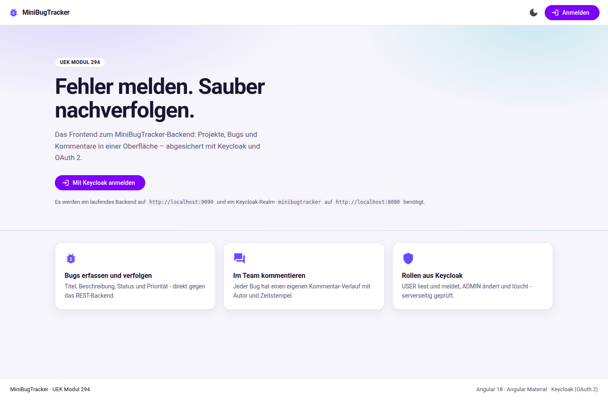
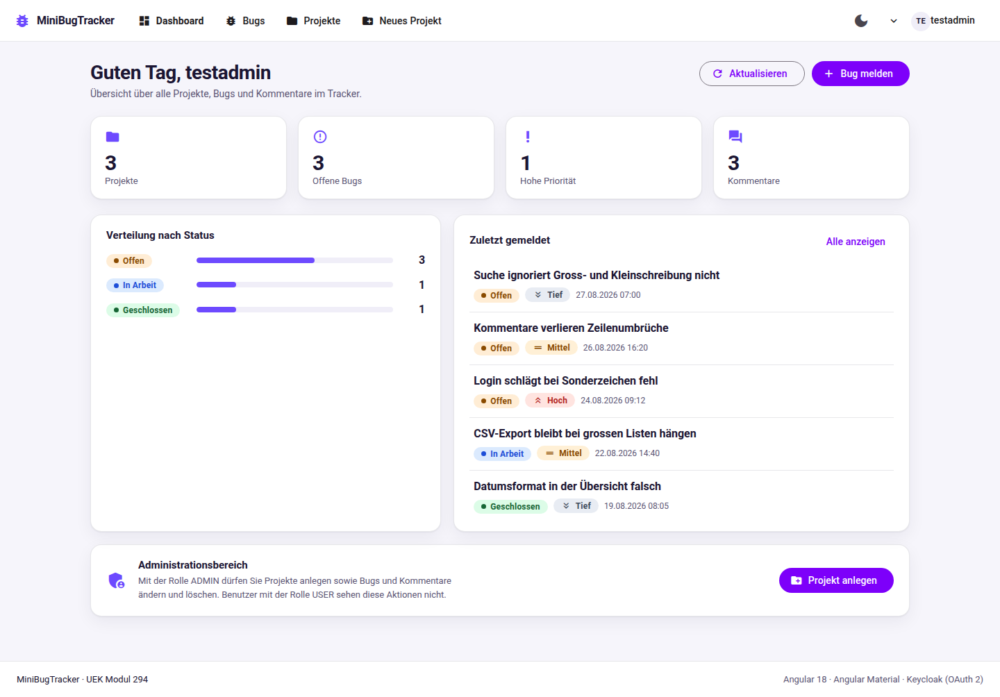
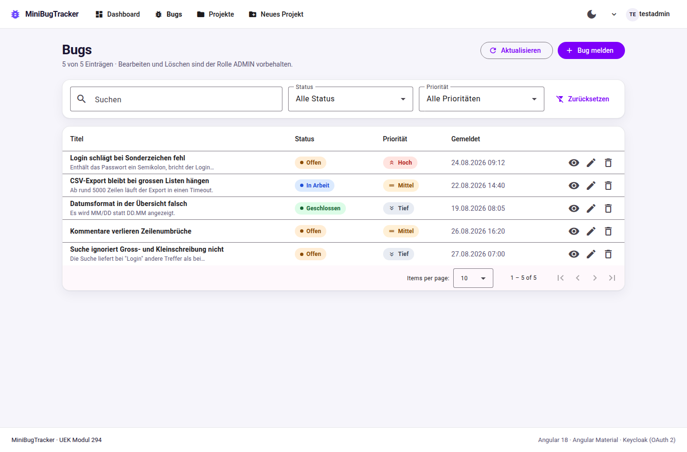
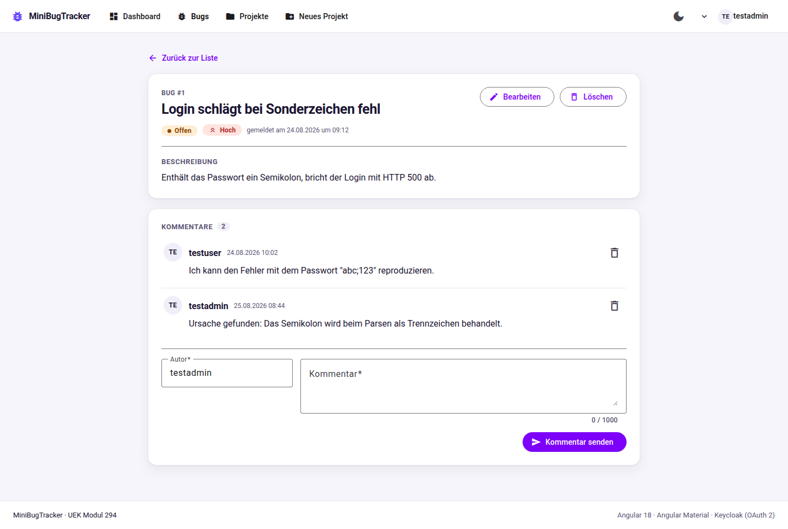
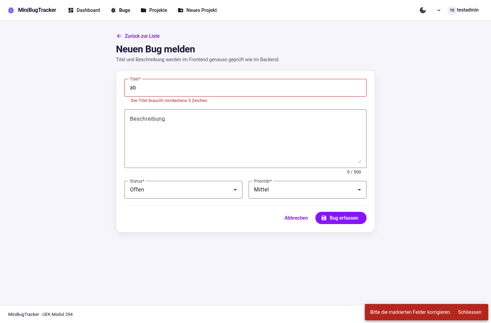
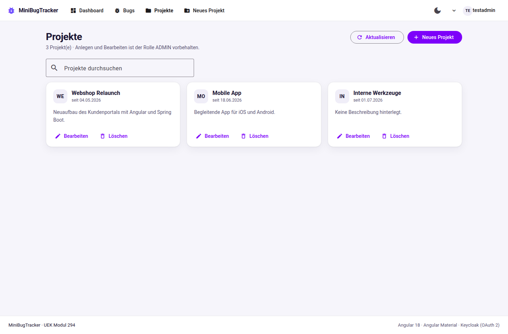
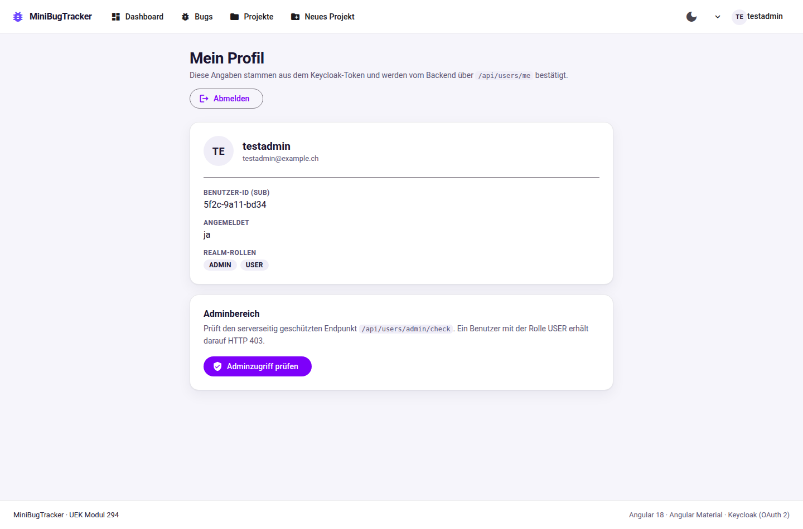
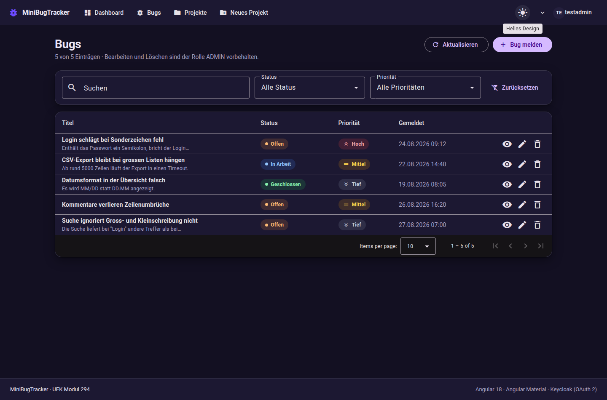

# MiniBugTracker – Frontend

Angular-Frontend zur Spring-Boot-Anwendung
[brixnc/minibugtracker](https://github.com/brixnc/minibugtracker).
Entstanden als Projektarbeit im **ÜK Modul 294 – Frontend einer interaktiven
Webapplikation realisieren**.

Die Anwendung verwaltet **Projekte**, **Bugs** und **Kommentare** über die
REST-Schnittstelle des Backends. Die Anmeldung läuft über **Keycloak
(OAuth 2 / OpenID Connect)**, die Realm-Rollen `USER` und `ADMIN` steuern,
welche Aktionen sichtbar und erlaubt sind.

---

## 1. Technischer Stack

| Baustein          | Version / Ausprägung                                  |
|-------------------|------------------------------------------------------------|
| Angular           | 18 (Standalone Components, Signals, neue Control-Flow-Syntax) |
| Angular Material  | 18 mit eigenem Material-3-Theme (hell und dunkel)           |
| Authentifizierung | `keycloak-angular` 16 / `keycloak-js` 25, OAuth 2 mit PKCE  |
| Formulare         | Reactive Forms mit Validatoren analog zur Bean Validation des Backends |
| Tests             | Karma und Jasmine, 31 Tests                                 |
| Codestyle         | ESLint mit `angular-eslint` (Konfiguration des Angular-CLI-Demoprojekts) |
| Schriften         | Roboto und Material Icons als npm-Pakete im Projekt, kein CDN nötig |

---

## 2. Schnellstart

### 2.1 Voraussetzungen

| Dienst                | Adresse                 | Bemerkung                                     |
|-----------------------|-------------------------|-----------------------------------------------|
| Backend (Spring Boot) | `http://localhost:9090` | Repository `minibugtracker`, siehe `docs/BACKEND-AENDERUNGEN.md` |
| Keycloak              | `http://localhost:8080` | Realm `minibugtracker`, siehe `docs/KEYCLOAK-SETUP.md` |
| PostgreSQL            | `localhost:5432`        | Datenbank `bugtracker_db` (vom Backend verwendet) |
| Node.js               | ab 18.19                | für Angular 18                                 |

### 2.2 Starten

```bash
npm install
npm start
```

Die Anwendung läuft danach auf <http://localhost:4200>.

`npm start` verwendet die Datei `proxy.conf.json`: Alle Aufrufe auf `/api`
werden vom Angular-Dev-Server an `http://localhost:9090` weitergeleitet.
Dadurch läuft die Entwicklung auch dann, wenn im Backend keine
CORS-Freigabe gesetzt ist. Der Produktionsbuild spricht das Backend direkt
unter `http://localhost:9090/api` an – dafür ist die CORS-Freigabe
nötig, die in `docs/BACKEND-AENDERUNGEN.md` beschrieben ist.

### 2.3 Weitere Befehle

| Befehl              | Wirkung                                                     |
|---------------------|-------------------------------------------------------------|
| `npm start`         | Entwicklungsserver mit Backend-Proxy auf Port 4200          |
| `npm run build`     | Produktionsbuild nach `dist/minibugtracker-frontend`        |
| `npm test`          | Unit-Tests im Browser mit Watch-Modus                        |
| `npm run test:ci`   | Unit-Tests einmalig und ohne Bildschirm (ChromeHeadless)     |
| `npm run lint`      | ESLint-Prüfung über TypeScript- und HTML-Dateien             |
| `npm run lint:fix`  | ESLint mit automatischer Korrektur                           |

---

## 3. Projektstruktur

```text
src/
├── app/
│   ├── core/                      Fachlich neutrale Basis
│   │   ├── directives/            has-role.directive.ts (rollenabhaengige Anzeige)
│   │   ├── guards/                auth.guard.ts, role.guard.ts
│   │   ├── interceptors/          auth.interceptor.ts (Bearer-Token), error.interceptor.ts
│   │   ├── models/                bug, project, comment, user - Mapping JSON auf Klassen
│   │   └── services/              CRUD-Services, AuthService, ThemeService, NotificationService
│   ├── features/                  Fachliche Seiten
│   │   ├── bugs/                  bug-list, bug-form, bug-detail
│   │   ├── comments/              comment-list, comment-form
│   │   ├── dashboard/             Kennzahlen und zuletzt gemeldete Bugs
│   │   ├── profile/               Identitaet und Rollen aus dem Token
│   │   └── projects/              project-list, project-form
│   ├── pages/                     home, forbidden, not-found
│   ├── shared/components/         toolbar, status-chip, priority-chip, confirm-dialog, empty-state
│   ├── app.component.*            Rahmen der Anwendung
│   ├── app.config.ts              Provider, Keycloak-Start, HTTP-Interceptoren
│   └── app.routes.ts              Routing inklusive Rollenpruefung
├── environments/                  environment.ts / environment.development.ts
└── styles.scss                    Material-3-Theme und semantische Farb-Tokens
```

Die Trennung folgt der üblichen Angular-Konvention:

* **core** – alles, was einmal existiert und überall gebraucht wird
  (Services, Guards, Interceptoren, Modelle).
* **features** – je Fachbereich ein Ordner mit den zugehörigen Komponenten.
* **shared** – wiederverwendbare Bausteine ohne eigene Fachlogik.

Alle Seiten werden über `loadComponent` **lazy** geladen, damit der
Startbundle klein bleibt.

---

## 4. Anbindung an das Backend

### 4.1 Services

Vier Services kapseln die REST-Schnittstelle. Sie geben `Observable`s
zurück und bilden die JSON-Antworten direkt auf die TypeScript-Modelle ab.

| Service          | Ressource        | Methoden                                                     |
|------------------|------------------|--------------------------------------------------------------|
| `BugService`     | `/api/bugs`      | `getAll`, `getById`, `create`, `update`, `remove`            |
| `ProjectService` | `/api/projects`  | `getAll`, `getById`, `create`, `update`, `remove`            |
| `CommentService` | `/api/comments`  | `getAll`, `getByBugId`, `getById`, `create`, `update`, `remove` |
| `UserService`    | `/api/users`     | `getCurrentUser`, `getCurrentUserRoles`, `adminCheck`        |

### 4.2 Berechtigungen

Die Tabelle entspricht genau den `@PreAuthorize`-Annotationen des Backends:

| Endpunkt                     | USER | ADMIN |
|------------------------------|:----:|:-----:|
| `GET /api/projects`          |  ✓   |   ✓   |
| `POST/PUT/DELETE /api/projects` |  ✗   |   ✓   |
| `GET /api/bugs`              |  ✓   |   ✓   |
| `POST /api/bugs`             |  ✓   |   ✓   |
| `PUT/DELETE /api/bugs/{id}`  |  ✗   |   ✓   |
| `GET /api/comments`          |  ✓   |   ✓   |
| `POST /api/comments`         |  ✓   |   ✓   |
| `PUT/DELETE /api/comments/{id}` |  ✗   |   ✓   |
| `GET /api/users/me`          |  ✓   |   ✓   |
| `GET /api/users/admin/check` |  ✗   |   ✓   |

### 4.3 Mapping JSON auf Klassen

Die Dateien in `core/models` bilden die JPA-Entities des Backends ab und
halten zusätzlich deren Feldlängen fest, damit Frontend und Backend nicht
auseinanderlaufen:

```ts
export interface Bug {
  id?: number;
  title: string;                 // @NotNull, @Size(min = 3, max = 100)
  description?: string | null;   // @Size(max = 500)
  status: BugStatus;             // OPEN | IN_PROGRESS | CLOSED
  priority: BugPriority;         // LOW | MEDIUM | HIGH
  createdAt?: string;            // @CreationTimestamp
}
```

> **Hinweis zum Datenmodell:** Das ER-Diagramm zeigt beim Bug ein Feld
> `project_id`. Die tatsächliche Entity `Bug.java` und der `BugController`
> kennen dieses Feld nicht. Das Frontend folgt dem Code, nicht dem Diagramm:
> Projekte und Bugs sind zwei eigenständige Listen, Kommentare verweisen
> über `bugId` auf ihren Bug.

### 4.4 Token-basierte Security

1. `app.config.ts` startet Keycloak per `APP_INITIALIZER` mit `check-sso`
   und PKCE. Ist bereits eine Sitzung vorhanden, landet der Benutzer ohne
   erneute Anmeldung in der Anwendung.
2. Der `authInterceptor` erneuert das Token bei Bedarf und hängt es als
   `Authorization: Bearer <token>` an jeden Backend-Aufruf.
3. Der `errorInterceptor` übersetzt `401` und `403` in verständliche
   Meldungen und leitet bei `403` auf die Seite „Kein Zugriff“.
4. `AuthService` stellt Benutzer und Rollen als **Signals** bereit; Guards,
   Templates und die Direktive `*appHasRole` greifen darauf zu.

Schlägt der Start von Keycloak fehl, startet die Anwendung trotzdem –
abgemeldet und mit einem Hinweis auf der Startseite statt eines weißen
Bildschirms.

---

## 5. Komponenten

18 Standalone-Komponenten, alle mit `ChangeDetectionStrategy.OnPush`:

| Komponente             | Aufgabe                                                        |
|------------------------|-----------------------------------------------------------------|
| `AppComponent`         | Rahmen aus Kopfzeile, Inhalt und Fußzeile                        |
| `ToolbarComponent`     | Navigation, Benutzermenü, Login/Logout, Themewechsel           |
| `HomeComponent`        | Öffentliche Startseite mit Einstieg in die Anmeldung            |
| `DashboardComponent`   | Kennzahlen, Statusverteilung, zuletzt gemeldete Bugs            |
| `BugListComponent`     | Material-Tabelle mit Sortierung, Filtern und Seitenwechsel       |
| `BugFormComponent`     | Bug erfassen und bearbeiten (Reactive Form)                     |
| `BugDetailComponent`   | Detailansicht mit Kommentarverlauf                               |
| `ProjectListComponent` | Projektübersicht als Kartenraster mit Suche                    |
| `ProjectFormComponent` | Projekt anlegen und bearbeiten (nur ADMIN)                      |
| `CommentListComponent` | Kommentarverlauf eines Bugs                                     |
| `CommentFormComponent` | Neuen Kommentar erfassen                                        |
| `ProfileComponent`     | Identität und Rollen, ADMIN-Prüfung gegen das Backend          |
| `StatusChipComponent`  | Farbige Statuskennzeichnung                                     |
| `PriorityChipComponent`| Farbige Prioritätskennzeichnung                                |
| `ConfirmDialogComponent`| Rückfrage vor dem Löschen                                     |
| `EmptyStateComponent`  | Platzhalter für leere Listen                                   |
| `ForbiddenComponent`   | Seite „Kein Zugriff“ bei fehlender Rolle                        |
| `NotFoundComponent`    | Auffangseite für unbekannte Adressen                           |

### 5.1 Validierung der Eingaben

Alle Formulare arbeiten mit **Reactive Forms**. Die Validatoren spiegeln die
Bean Validation des Backends:

| Feld                  | Regel                          | Herkunft         |
|-----------------------|--------------------------------|------------------|
| Bug – Titel          | Pflicht, 3 bis 100 Zeichen     | `Bug.java`       |
| Bug – Beschreibung   | höchstens 500 Zeichen         | `Bug.java`       |
| Bug – Status/Prio    | Pflicht, Auswahl aus dem Enum  | `Bug.java`       |
| Projekt – Name       | Pflicht, 2 bis 100 Zeichen     | `Project.java`   |
| Projekt – Beschreibung | höchstens 300 Zeichen       | `Project.java`   |
| Kommentar – Autor    | Pflicht, 2 bis 100 Zeichen     | `Comment.java`   |
| Kommentar – Text     | Pflicht, 1 bis 1000 Zeichen    | `Comment.java`   |

Fehlermeldungen erscheinen feldbezogen als `mat-error`, Textfelder zeigen
zusätzlich einen Zeichenzähler.

### 5.2 Rollenabhängige Anzeige

Die Direktive `*appHasRole` blendet Bereiche abhängig von der Realm-Rolle
ein oder aus:

```html
<button *appHasRole="['ADMIN']" mat-icon-button (click)="remove(bug, $event)">
  <mat-icon>delete_outline</mat-icon>
</button>
```

Betroffen sind unter anderem:

* Bug-Liste und Bug-Detail: Bearbeiten und Löschen nur für ADMIN
* Projekt-Übersicht: Anlegen, Bearbeiten und Löschen nur für ADMIN
* Kommentare: Löschen nur für ADMIN
* Dashboard und Profil: eigener Administrationsbereich nur für ADMIN
* Toolbar: der Punkt „Neues Projekt“ nur für ADMIN

Die Oberfläche ist dabei nur die erste Ebene. Verbindlich entscheidet das
Backend – ein `403` wird abgefangen und als Meldung angezeigt.

---

## 6. Tests

```bash
npm run test:ci
```

31 Tests in sechs Dateien:

| Datei                          | Gegenstand                                                   |
|--------------------------------|--------------------------------------------------------------|
| `bug.service.spec.ts`          | **Service-Test**: URL und HTTP-Methode je CRUD-Aufruf, Mapping der Antwort, Fehlerweitergabe |
| `bug-list.component.spec.ts`   | **Komponenten-Test**: Tabellenzeilen, Filterlogik, rollenabhängige Schaltflächen |
| `bug-detail.component.spec.ts` | Laden über den Routenparameter, Kommentarverlauf, Rollentrennung |
| `auth.service.spec.ts`         | Rollenauswertung, Profil-Nachladen, Abmeldezustand            |
| `app.component.spec.ts`        | Rahmen der Anwendung und Anmelde-Einstieg                     |
| `paginator-intl.spec.ts`       | Deutsche Beschriftungen des Material-Paginators               |

Backend und Keycloak werden dabei durch Testdoubles ersetzt
(`HttpTestingController`, `KeycloakServiceStub`), es findet kein echter
Netzwerkzugriff statt.

---

## 7. Codestyle

ESLint ist über `ng add @angular-eslint/schematics` eingerichtet, also mit
der Standardkonfiguration des Angular-CLI-Demoprojekts (`eslint.config.js`).

```bash
npm run lint
# Linting "minibugtracker-frontend"...
# All files pass linting.
```

---

## 8. Bildschirmfotos

Die Aufnahmen zeigen die laufende Anwendung mit Beispieldaten.

| Ansicht | Bild |
|---------|------|
| Startseite (abgemeldet) |  |
| Dashboard |  |
| Bug-Liste mit Filtern |  |
| Bug-Detail mit Kommentaren |  |
| Formular mit Validierungsfehler |  |
| Projekt-Übersicht |  |
| Profil mit Rollen |  |
| Dunkles Design |  |

---

## 9. Weiterführende Dokumente

| Datei                          | Inhalt                                              |
|--------------------------------|-----------------------------------------------------|
| `docs/KEYCLOAK-SETUP.md`       | Realm, Client, Rollen und Testbenutzer einrichten    |
| `docs/BACKEND-AENDERUNGEN.md`  | Die CORS-Ergänzung im Spring-Boot-Backend           |
